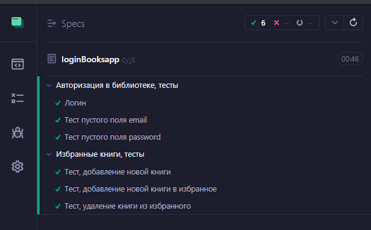

## Домашнее задание к занятию «7.6. Cypress 1»
1. Сделан `fork` [проекта Book list]("https://github.com/netology-code/jsaqa-code/tree/main/booksApp").
2. Приложение запущено при помощи команд `npm install`, `npm run server`, `npm start`.
3. Создан новый проект для тестов `Cypress`.
4. Создан spec-тест `"loginBooksapp.cy.js"`.
5. Добавлены тесты авторизации.
6. Добавлены 3 теста для проверки функциональности работы с книгами в избранном.
7. Добавлены вторая конфигурация для запуска. Настроен параметр `view-port` для двух разных размеров экрана.
8. Настроены 4 скрипта для запуска в режимах headded и headless и разные браузеры для каждой из конфигураций.
